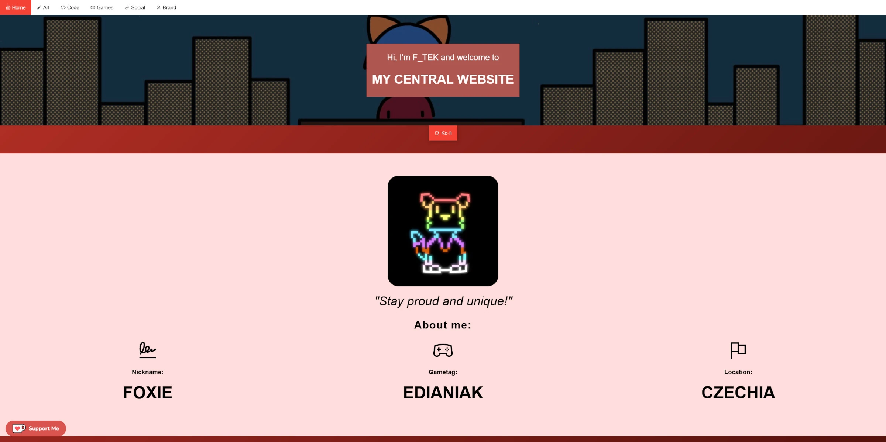

# F_TEK's Central Website

[License](https://github.com/FTEdianiaK/f-tek/blob/main/LICENSE) | [Asset License](https://creativecommons.org/licenses/by-sa/4.0/)

### Passed checks

- Validated by [W3C Validator](https://validator.w3.org/)
	- All HTML and CSS is valid!
- Checked by [Yellow Lab Tools](https://yellowlab.tools/)
	- All pages got an **A**!

### Credits

**Webhosting:** [Neocities](https://neocities.org/)

**CSS:** [W3.CSS - by W3Schools - n/a](https://www.w3schools.com/w3css/)

**Icons:** [Line Awesome - by Icons8 - MIT + Good Boy](https://icons8.com/line-awesome)

**/code.html Background:** Photo by <a href="https://unsplash.com/@florianolv?utm_content=creditCopyText&utm_medium=referral&utm_source=unsplash">Florian Olivo</a> on <a href="https://unsplash.com/photos/lines-of-html-codes-4hbJ-eymZ1o?utm_content=creditCopyText&utm_medium=referral&utm_source=unsplash">Unsplash</a>

**Javascripts:**

- [Modal](https://www.w3schools.com/w3css/w3css_modal.asp), [Collapsible menu](https://www.w3schools.com/w3css/w3css_navigation.asp) - by W3Schools
- [Countup](https://codepen.io/jshakes/pen/KKpjdYv) - by James
- [Lazysizes](https://github.com/aFarkas/lazysizes) - by Alexander Farkas - MIT

**Services:**

- [GoatCounter](https://www.goatcounter.com/) - Analytics