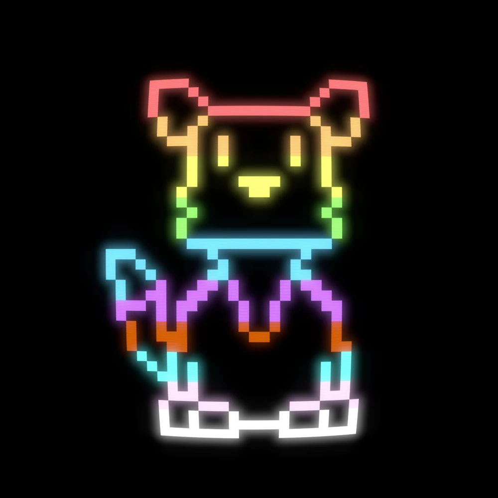
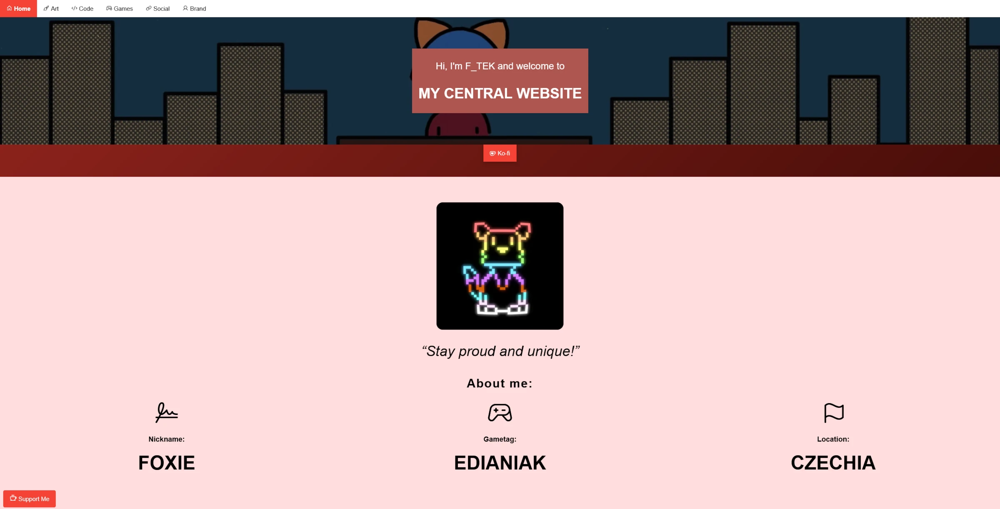

<h1 align="center">
     
    
     
    F_TEK's Central Website
     
</h1>

<h4 align="center">F_TEK's personal website.</h4>

     |
     |
    

    <a href="#passed-checks">Passed checks</a> |
    <a href="#credits">Credits</a>

## Passed checks

- Validated by [W3C Validator](https://validator.w3.org/)
	- All HTML and CSS files are **valid**!
- Checked by [Yellow Lab Tools](https://yellowlab.tools/)
	- All pages got an **A**! (except for the Web Gallery, that one got a **C**)
- Compliant with [IBM Equal Access Accessibility Checker](https://github.com/IBMa/equal-access)
	- At least as much as I could make it.

## Credits

**Webhosting:** [Neocities](https://neocities.org/)

**CSS:** [W3.CSS - by W3Schools](https://www.w3schools.com/w3css/)

**Palettes:** [Color Hunt - by Gal Shir](https://colorhunt.co/)

**Icons:**

- [Phosphor Icons - MIT](https://phosphoricons.com/)
- [Simple Icons - CC0](https://simpleicons.org)
- [Game Icons - CC-BY 3.0](https://game-icons.net/)

**Backgrounds:**

- /code.html - Photo by <a href="https://unsplash.com/@florianolv?utm_content=creditCopyText&utm_medium=referral&utm_source=unsplash">Florian Olivo</a> on <a href="https://unsplash.com/photos/lines-of-html-codes-4hbJ-eymZ1o?utm_content=creditCopyText&utm_medium=referral&utm_source=unsplash">Unsplash</a>

**Javascripts:**

- [Modal](https://www.w3schools.com/w3css/w3css_modal.asp), [Collapsible menu](https://www.w3schools.com/w3css/w3css_navigation.asp) - by W3Schools
- [Countup](https://codepen.io/jshakes/pen/KKpjdYv) - by James
- [Neon](https://codepen.io/leadmanagement/pen/zYvPRvx) - by LeadManagement
- [Lazysizes](https://github.com/aFarkas/lazysizes) - by Alexander Farkas - MIT

